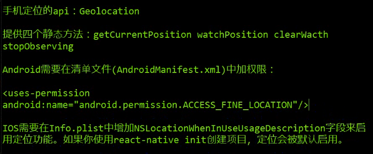

# react-native-amap-retro
根据高德地图寻找附近小区的名称    

只需要明白react native如何与webview通信，web端能实现的功能基本可以用在react native上，文档参考[react native webview](https://reactnative.cn/docs/0.49/webview.html#content)和[高德地图JavaScript API](https://lbs.amap.com/api/javascript-api/summary/)

## 安装

git clone https://github.com/MrRetro/react-native-amap-retro.git    
cd react-native-amap-retro    
npm install    

    
#### 这边踩了个坑，当android或IOS显示不出地图的时候，其实是权限没有开启

